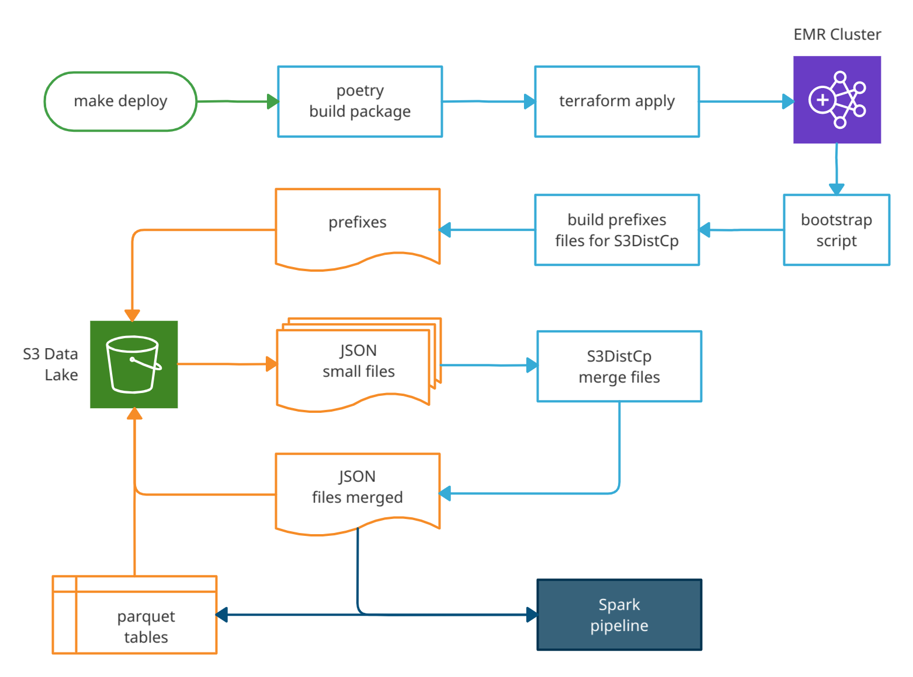
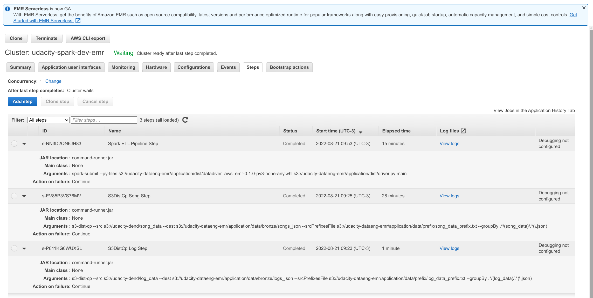
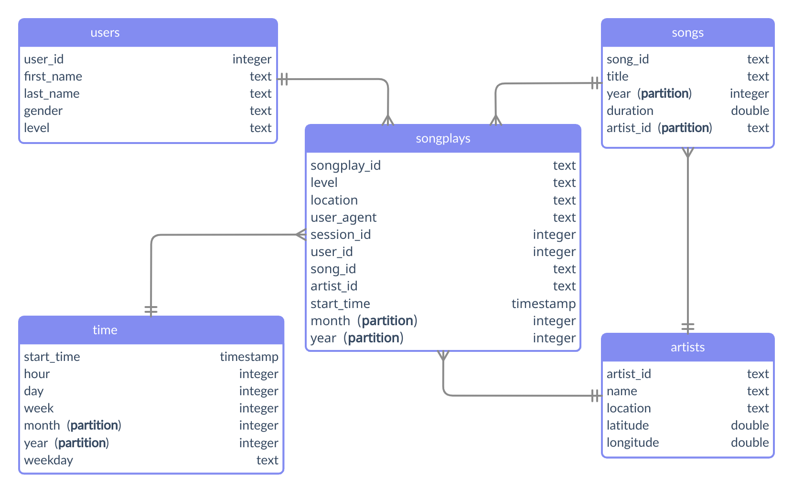
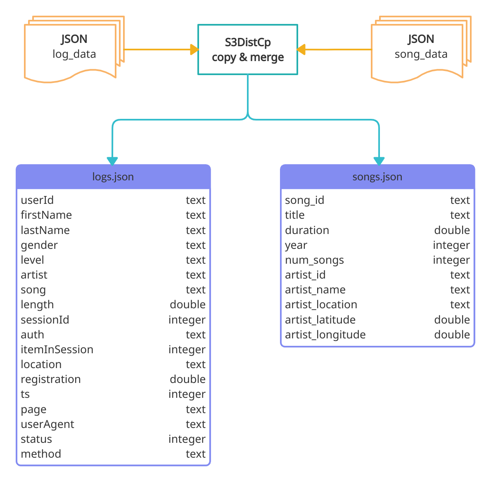

# AWS S3 Data Lake & AWS EMR Spark Processing

---

> Author: Rodrigo de Alvarenga Mattos 

## Introduction

The goal of this project is to build an ETL pipeline for a data lake hosted on AWS S3 storage. The data is a numerous set of small JSON files that must be loaded from the S3 source, processed by Apache Spark, and loaded back to S3 as parquet tables.

## Project Dependencies

- [Poetry 1.1.14](https://python-poetry.org/docs/)
- [PySpark 3.2.1](https://spark.apache.org/docs/latest/api/python/)
- [Python 3.7](https://www.python.org)
- [Terraform 1.2.7](https://www.terraform.io)
- [Sphinx 5.1.1](https://www.sphinx-doc.org)

The Poetry package manager was used to manage dependencies and build the wheel distribution that is deployed by the spark-submit command.  

```bash
# install poetry for dependency management and packaging
pip install poetry

# install project dependencies from pyproject.toml
poetry install
```

## Auto-generate API Documentation

The [Sphinx](https://www.sphinx-doc.org) documentation generator was used to build the [HTML docs](https://htmlpreview.github.io/?https://github.com/rodrigoalvamat/certification-dataeng-aws-emr/blob/main/docs/build/html/index.html) from the source code ```DOCSTRIGS```.

## AWS Services and Resources

This is the list of services that have been provisioned in the AWS cloud:

| Service         | Resources                         | Description                           |
| --------------- | --------------------------------- | ------------------------------------- |
| **IAM**         | Policy                            | EMR, S3 and EC2 Predefined Access.    |
| **IAM**         | Role                              | EMR default service role.             |
| **S3**          | Data Lake Bucket                  | Storage data source and target.       |
| **VPC**         | Subnet Group and VPN Gateway      | EMR virtual networking environment.   |
| **VPC**         | Security Group                    | EMR inbound and outbound traffic.     |
| **EMR Cluster** | EC2 master and workers instances. | Customized cloud big data processing. |

## Terraform Infrastructure as a Code

We used Terraform to automate infrastructure provisioning, including servers, network, permissions, and security. Please follow the instructions below before running Terraform commands:

1. Check if you have terraform installed or follow the [instructions in the website](https://learn.hashicorp.com/tutorials/terraform/install-cli):

```bash
# check terraform installation
terraform version
```

2. Make sure you have the [AWS Command Line Interface](https://aws.amazon.com/cli) installed, the user is logged in and the default region is set:

```python
# check the current user
aws iam get-user
# the default region should be set
aws configure get region
```

## Running the ETL Pipeline on AWS EMR

The table below describes the main processes that take place from provisioning the cluster to writing the parquet tables.

| Step         | Description                                                                         | Action        |
| ------------ | ----------------------------------------------------------------------------------- | ------------- |
| make deploy  | Call poetry build and call terraform apply                                          | user  command |
| poetry       | Builds the python package                                                           | auto          |
| terraform    | Provision the cluster and upload the necessary files                                | auto          |
| bootstrap    | Shell script that generates prefixes files for the s3-dist-cp tool                  | auto          |
| s3-dist-cp   | Step functions to load the small JSON data files and merge them in another folder   | auto          |
| spark-submit | Step function to run the ETL pipeline, load, transform and write the parquet tables | auto          |
| make destroy | Call terraform destroy to terminate all AWS resources                               | user command  |

The diagram below shows the execution order of each step and the flow of loading and transforming data along the pipeline:

<div style='background-color:#fff;padding:24px;'>

</div>

**IMPORTANT:** This project is configured to provision a cluster with 1 master instance and 2 workers. You can change these settings in the [terraform/variables.tf](./terraform/variables.tf) file.

```bash
# run the project
make deploy
```

**NOTE:**  Although automated, the entire process takes about **55 minutes**. Cluster provisioning takes approximately 10 minutes and the distribution of the remaining time can be seen in the image below:

<div style='background-color:#fff;padding:24px;'>

</div>

## Running the ETL Pipeline on Docker

If you want to test the project locally, please check if you have an updated version of docker or download and install it for your operating system according to the instructions on the [website](https://docs.docker.com).

```bash
# call docker composer to start a local cluster
make docker-composer
# execute the python script pipeline
make run
```

## Parquet Tables Schema

The analytic tables were partitioned according to the schema shown in the following diagram.

1. **Songs** - Partition by *artist_id* and *year*. 

2. **Time** - Partition by *month* and *year*.

3. **Songplays** - Partition by *month* and *year*.

<div style='background-color:#fff;padding:24px;'>

</div>

## Raw JSON Data

The figure below shows the raw JSON file structure and the merging process by the S3DistCp tool.

<div style='background-color:#fff;padding:24px;'>

</div>

## S3DistCp and the Small Files Problem

The S3DistCp tool is recommended, by the AWS big data team, as a best practice for optimizing S3 data access by EMR and Glue. Unfortunately, the documentation does not provide all the information clearly, in one place. However, the end result delivers better performance and greater scalability when compared to the following options:

1. **Process Small Files:** Generates metadata overload, query performance degradation, skewed task loading, and name node overhead.

2. **Coalesce or Repartition:** They are not optimized to satisfy S3 performance requirements. [According to this article](https://aws.amazon.com/blogs/big-data/best-practices-to-optimize-data-access-performance-from-amazon-emr-and-aws-glue-to-amazon-s3), the best performance occurs when the write and read operations are distributed by prefix (directory) and not by bucket.

Therefore, we will describe each step needed to copy and merge small files on S3 using S3DistCp in the following table:

| Entry Point   | Task                         | Outcome                                                                |
| ------------- | ---------------------------- | ---------------------------------------------------------------------- |
| bootstrap.sh  | aws s3 ls <path> --recursive | Store a list of S3 objects  in local txt files                         |
| bootstrap.sh  | sed -ir <regexp>             | Clean txt files resulting in a list of directory prefixes              |
| bootstrap.sh  | awk                          | Remove duplicate prefixes                                              |
| bootstrap.sh  | aws s3 cp                    | Copy local txt prefixes files do S3                                    |
| step function | s3-dist-cp                   | Copy files using the --srcPrefixesFile argument do distribute the load |
| step function | s3-dist-cp                   | Merge files using the --groupBy <regexp> criteria                      |

Take a look at the source code of the [bootstrap.sh](./bin/bootstrap.sh) shell script and the terraform [emr.tf](./terraform/emr.tf) resources declaration to understand the details of each task.

1. [S3DistCp Documentation](https://docs.aws.amazon.com/emr/latest/ReleaseGuide/UsingEMR_s3distcp.html)

2. [7 Tips for Using S3DistCp](https://aws.amazon.com/blogs/big-data/seven-tips-for-using-s3distcp-on-amazon-emr-to-move-data-efficiently-between-hdfs-and-amazon-s3/)

## Utils

There are some scripts in the [bin](./bin) directory to make it easier to troubleshoot and monitor the cluster while it is running. 

**NOTE:** All scripts depend on the successful execution of the `make deploy`  when terraform automatically generates the `$HOME/.ssh/cluster-key.pem` and `./config/emr.cfg` files with DNS and ClusterID information.

| Script                    | Descripton                                                                                                                                   |
| ------------------------- | -------------------------------------------------------------------------------------------------------------------------------------------- |
| ./bin/describe-cluster.sh | Gets the cluster information provided by the aws cli                                                                                         |
| ./bin/ssh-cluster.sh      | SSH login to the cluster master node                                                                                                         |
| ./bin/ssh-copy.sh         | Copy the cluste-key.pem to the cluster master node                                                                                           |
| ./bin/submit.sh           | SSH call to the spark-submit with the project package on dist                                                                                |
| ./bin/cluster-tunnel.sh   | Uses dynamic port forwarding to access master node on[ http://localhost:8157](http://localhost:8157)                                         |
| ./bin/zeppelin-tunnel.sh  | Uses dynamic port forwarding to access the Zeppelin notebook server and run Spark iteratively[ http://localhost:8157](http://localhost:8157) |

## Destroy the Cluster

Don't forget to shutdown your cluster.

```bash
# using make
make destroy
# using terraform
cd ./terraform
terraform destroy
```
